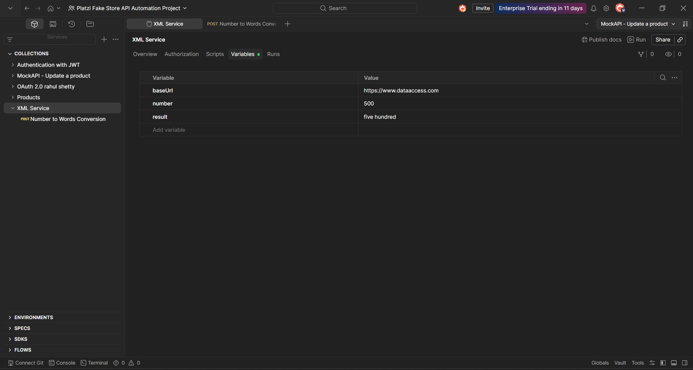
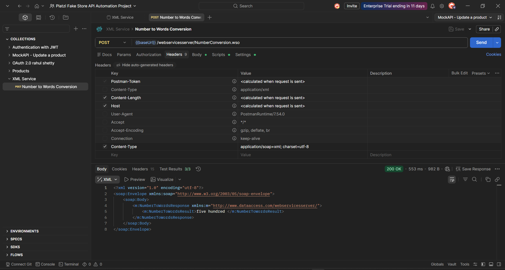
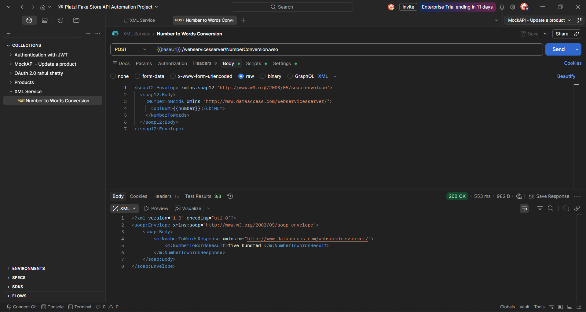
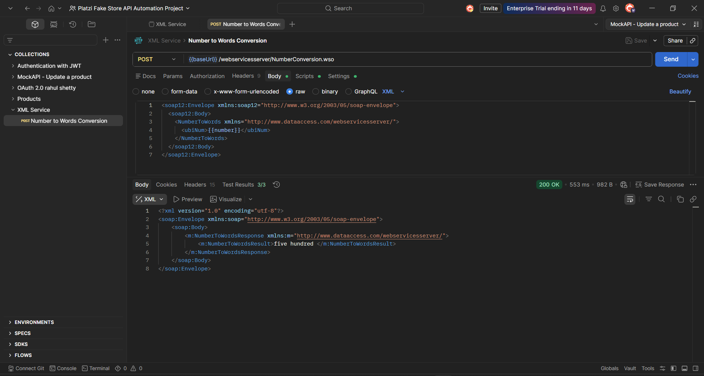
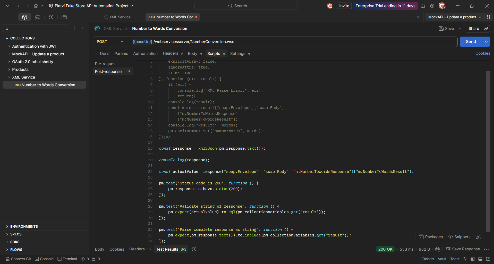
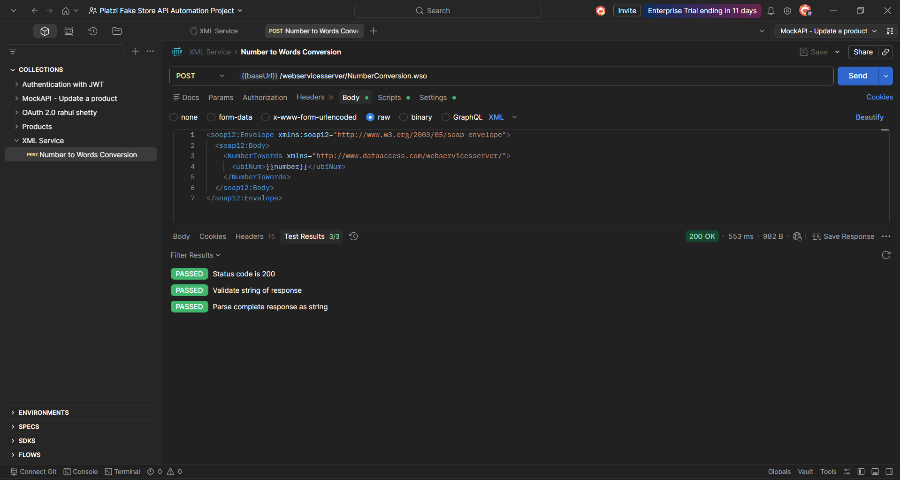

# NumberToWords XML Response Validation with Postman

This project demonstrates how to test the **NumberToWords** XML-based API using Postman.

The API accepts a number in an XML request body and returns the number written in words inside an XML response.

The project focuses on XML response parsing, XML-to-JSON conversion, dynamic variables, and automated response validation using Postman test scripts.

---

## Project Scope

This project covers:

- Creating a Postman collection for the NumberToWords API
- Sending XML request bodies using the `POST` method
- Using collection variables for dynamic input data
- Setting the required XML content type header
- Reading XML responses as plain text
- Converting XML responses to JSON using `xml2Json` or `xml2js`
- Extracting nested XML values from the response
- Handling XML namespace prefixes using bracket notation
- Validating exact XML tag values
- Validating the full XML response as a string
- Adding HTTP status code assertions

---

## API Under Test

### Base URL

```text
https://www.dataaccess.com
```

### Endpoint

```text
/webservicesserver/NumberConversion.wso
```

### Operation

```text
NumberToWords
```

### Method

```text
POST
```

### Full Request URL

```text
{{baseUrl}}/webservicesserver/NumberConversion.wso
```

---

## Collection Variables

The collection uses variables to make the request and validation dynamic.

| Variable | Description | Example |
|---|---|---|
| `baseUrl` | Base URL of the API | `https://www.dataaccess.com` |
| `number` | Number sent in the XML request body | `500` |
| `result` | Expected value returned in the XML response | `five hundred` |

---

## Request Configuration

The request is sent using the `POST` method.

The body type is set to raw XML.

The request uses the following header:

| Key | Value |
|---|---|
| `Content-Type` | `application/soap+xml; charset=utf-8` |

Postman may auto-generate a default `Content-Type` header such as:

```text
application/xml
```

For this request, the correct content type used is:

```text
application/soap+xml; charset=utf-8
```

---

## XML Request Body

The request body is sent as raw XML.

```xml
<soap12:Envelope xmlns:soap12="http://www.w3.org/2003/05/soap-envelope">
  <soap12:Body>
    <NumberToWords xmlns="http://www.dataaccess.com/webservicesserver/">
      <ubiNum>{{number}}</ubiNum>
    </NumberToWords>
  </soap12:Body>
</soap12:Envelope>
```

The value of `ubiNum` is dynamic and comes from the collection variable:

```text
{{number}}
```

---

## Sample XML Response

Example response when `number = 500`:

```xml
<?xml version="1.0" encoding="utf-8"?>
<soap:Envelope xmlns:soap="http://www.w3.org/2003/05/soap-envelope">
  <soap:Body>
    <m:NumberToWordsResponse xmlns:m="http://www.dataaccess.com/webservicesserver/">
      <m:NumberToWordsResult>five hundred</m:NumberToWordsResult>
    </m:NumberToWordsResponse>
  </soap:Body>
</soap:Envelope>
```

The value validated by the tests is inside:

```xml
<m:NumberToWordsResult>five hundred</m:NumberToWordsResult>
```

---

## Automated Test Scripts

The project includes three main automated validations.

---

### 1. Status Code Validation

This test verifies that the API returns HTTP status code `200`.

```javascript
pm.test("status code is 200", function () {
    pm.response.to.have.status(200);
});
```

---

### 2. XML-to-JSON Parsing and Exact Tag Validation

Since the response is XML, the response is first read as text using:

```javascript
pm.response.text()
```

Then it is converted into a JSON-like object using:

```javascript
xml2Json()
```

Full validation script:

```javascript
const response = xml2Json(pm.response.text());

console.log(response);

const actualValue =
    response["soap:Envelope"]
            ["soap:Body"]
            ["m:NumberToWordsResponse"]
            ["m:NumberToWordsResult"];

pm.test("validate string of response", function () {
    pm.expect(actualValue).to.eql(pm.collectionVariables.get("result"));
});
```

This test extracts the value from:

```text
soap:Envelope → soap:Body → m:NumberToWordsResponse → m:NumberToWordsResult
```

Then it compares the actual value with the expected value stored in the collection variable:

```text
{{result}}
```

---

### 3. Complete XML Response String Validation

This test checks whether the expected value exists anywhere inside the full XML response.

```javascript
pm.test("parse complete response as string", function () {
    pm.expect(pm.response.text()).to.include(pm.collectionVariables.get("result"));
});
```

This validation is useful when we only need to confirm that a value exists somewhere in the XML response.

---

## Full Postman Test Script

```javascript
const response = xml2Json(pm.response.text());

console.log(response);

const actualValue =
    response["soap:Envelope"]
            ["soap:Body"]
            ["m:NumberToWordsResponse"]
            ["m:NumberToWordsResult"];

pm.test("status code is 200", function () {
    pm.response.to.have.status(200);
});

pm.test("validate string of response", function () {
    pm.expect(actualValue).to.eql(pm.collectionVariables.get("result"));
});

pm.test("parse complete response as string", function () {
    pm.expect(pm.response.text()).to.include(pm.collectionVariables.get("result"));
});
```

---

## Why Bracket Notation Is Used

After converting XML to JSON, XML namespace prefixes remain part of the object keys.

Examples:

- `soap:Envelope`
- `soap:Body`
- `m:NumberToWordsResponse`
- `m:NumberToWordsResult`

These keys contain the `:` character.

Because of that, JavaScript dot notation will not work.

Incorrect:

```javascript
response.soap:Envelope
```

Correct:

```javascript
response["soap:Envelope"]
```

That is why the script uses bracket notation to access XML nodes safely.

---

## Exact Tag Validation vs Full Response Validation

This project uses two XML validation approaches.

| Validation Type | Purpose |
|---|---|
| Exact tag validation | Confirms the value exists in the correct XML node |
| Full response string validation | Confirms the value exists anywhere in the XML response |

Exact tag validation is more accurate because it validates the value in the correct XML tag.

Full response validation is simpler and useful for quick checks.

---

## Example Test Data

| Number | Expected Result |
|---:|---|
| `100` | `one hundred` |
| `200` | `two hundred` |
| `300` | `three hundred` |
| `400` | `four hundred` |
| `500` | `five hundred` |
| `1000` | `one thousand` |

---

## How to Run the Project

1. Clone this repository.
2. Open Postman.
3. Import the collection from the `postman` folder.
4. Open the collection variables.
5. Set the following variables:
   - `baseUrl`
   - `number`
   - `result`
6. Open the `Number to Words Conversion` request.
7. Click **Send**.
8. Check the **Test Results** tab.

---

## Suggested Project Structure

```text
NumberToWords-XML-Response-Validation-with-Postman/
│
├── README.md
├── postman/
│   └── NumberToWords.postman_collection.json
├── screenshots/
│   ├── collection-variables.png
│   ├── request-headers.png
│   ├── request-body.png
│   ├── response-body.png
│   ├── test-scripts.png
│   └── test-results.png
└── .gitignore
```

---

## Screenshots

### Collection Variables



### Request Headers



### XML Request Body



### XML Response Body



### Test Scripts



### Test Results



---

## Key Learnings

Through this project, I practiced:

- Creating XML-based requests in Postman
- Sending dynamic XML request data using collection variables
- Setting the correct `Content-Type` header
- Reading XML responses as plain text
- Converting XML responses into JSON-like objects using `xml2Json`
- Accessing XML nodes that contain namespace prefixes
- Using bracket notation for keys with special characters
- Validating exact XML response values
- Validating complete XML response content
- Writing automated Postman test scripts

---

## Technologies Used

- Postman
- XML
- JavaScript
- Postman Test Scripts
- XML-to-JSON parsing using `xml2Json`

---

## Repository Topics

Recommended GitHub topics:

- `postman`
- `xml`
- `number-to-words`
- `api-testing`
- `test-automation`
- `postman-tests`
- `xml-parsing`
- `qa-automation`
- `javascript`

---

## Notes

This project focuses on the **NumberToWords** operation only.

The same approach can be applied to other XML-based APIs where the response needs to be parsed and validated using Postman scripts.

---

## Author

Created as part of my API Testing learning journey using Postman.
